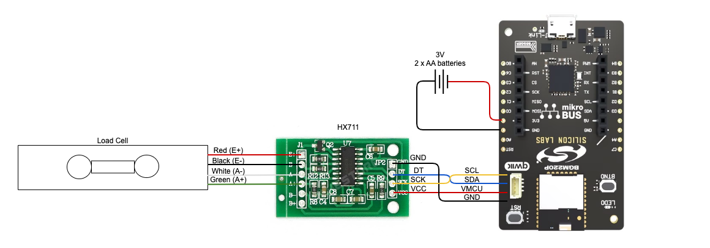
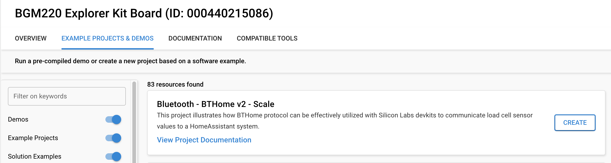
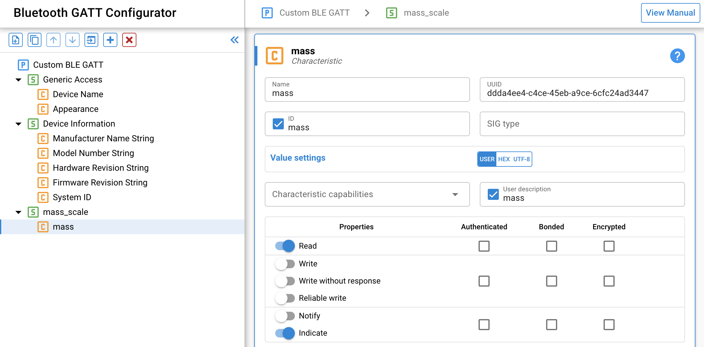

# Smart Scale

## Design principles

The smart scale has to meet the following requirements
- "Smart": It can be accessed remotely (wireless) by a client and integrated into a smart home network
  (e.g. [Home Assistant](https://www.home-assistant.io/))
- Low power: The device should operate at least 1 year from battery
- Low cost: the device should be in the range of 20-30 USD
- Measurement range: 0-3 kg, 1 g resolution
- Small form factor: although smart bathroom scales are common, smart kitchen scales are not

## Reference hardware

To meet the above requirements, the reference hardware is based on a second-hand kitchen scale,
namely the Soehnle 65106 Fiesta (~6.5 USD). This kitchen scale comes with a bar-type load cell.
The signal from the load cell is processed by an [HX711 ADC](https://cdn.sparkfun.com/datasheets/Sensors/ForceFlex/hx711_english.pdf).
[Here](https://learn.sparkfun.com/tutorials/load-cell-amplifier-hx711-breakout-hookup-guide) is a
nice article about different load cell types and how to connect them to the HX711 breakout board
(11 USD at Sparkfun, but similar board with HX711 is available for 1-2 USD).
The connectivity is provided by Silicon Labs' [BGM220 Bluetooth Module Explorer Kit](
    https://www.silabs.com/development-tools/wireless/bluetooth/bgm220-explorer-kit?tab=overview)
(12 USD). This board reads the digital signal from the HX711 and transmits via BLE. The 2 buttons
(TARE and ON-OFF) of the kitchen scale are also connected to the Bluetooth module. The kitchen scale
operates from 2 AA batteries.

> ⚠️ During battery operation, the USB cable must be removed. Failure to follow this guideline can
cause power conflicts and damage the LDO.

## Software requirements

[Simplicity Studio](https://www.silabs.com/developers/simplicity-studio)

[Simplicity SDK](https://github.com/SiliconLabs/simplicity_sdk)
(tested with [SiSDK v2024.6.0](https://github.com/SiliconLabs/simplicity_sdk/releases/tag/v2024.6.0))

Once you have Simplicity Studio installed, you can get the latest Simplicity SDK within the Studio.
Then go to Preferences > Simplicity Studio > External Repos and add this repo.
After this, you can browse the example in this repo just like any other Bluetooth example.

## Project creation and configuration

After the board and the project is selected in the Studio Launcher, press the Create button, and
click `Next` in the new project wizard panel until the project is created.

### Logging

The project comes with application logging turned on by default on the VCOM port. It acts like an
emulated serial port that can be opened by any serial console software like Tera Term or PuTTY.
While it is useful for debugging, it might be removed from the project in a battery powered product
to reduce power consumption. Logging can be removed from the project by removing the
`Application | Utility | Log` component and the `vcom` instance of the `Services | IO Stream | IO Stream: USART`
component.

### Pin configuration

There are some external peripherals like the HX711 data amd clock pins and the extra push button,
which are pre-configured for the BRD4314A board to make the project build out-of-the-box. When
creating your own custom project, make sure to configure these pins according to your hardware.

## Features and operation

### HX711 driver

The HX711 driver in this project is a slightly customized version of [this driver](https://github.com/SKZ81/HX711).
The main difference is that the platform abstraction has been moved to a [dedicated header](hx711_platform.h).

To get the measurement value in the expected units (e.g. grams), the scale parameter of this driver
must be calibrated to the actual hardware. Currently, this is done via the `DEFAULT_SCALE` macro.

The offset (i.e. tare) is set during init and on pressing the BTN1 button.

When pressing the BTN0 button, a measurement is performed and the result is logged to VCOM.

### BThome v2

This project uses BTHome v2 as a primary channel to broadcast the measurement data.
The [BTHome v2 format](https://bthome.io/format/) is a standard way for broadcasting sensor data in
BLE advertising messages. The bthome_v2 module in this project helps to construct these messages and
start/stop the advertising. The original module is published
[here](https://github.com/SiliconLabs/third_party_hw_drivers_extension/tree/master/driver/public/silabs/bthome_v2).
[Here](https://github.com/SiliconLabs/bluetooth_applications/tree/master/bluetooth_bthome_v2_internal_temperature_monitor)
is an example project that showcases the integration of a BTHome sensor into a Home Assistant system
using this module.
Some changes have been made to the original module to make it suitable for this project.
1. Change advertising interval from 100 ms to 1000 +/- 100 ms (reduce power consumption)
2. Change connection mode from non-connectable to connectable

Please note that the advertising interval and the sensor sampling interval (configured with the
`MEASUREMENT_INTERVAL_ADV_MS` macro) are independent parameters.

This project uses the mass sensor data type (0x06) to represent measurement data.
The unit is specified as kg with a scale factor of 0.01, i.e. the resolution of this data type is
10 grams. The required resolution of this project is 1 gram. Therefore, the mass is represented in
grams instead of kilograms, so it has to be interpreted accordingly on the client side.

The device advertises itself with the name `Mass`.

### GATT

The mass sensor data is also available as a GATT characteristic. The characteristic has a custom
UUID under a custom service.

The characteristic value is a 4 bytes long signed integer in little-endian format (LSB first).
This value can be accessed in 2 ways:
1. Read: reading the value triggers a measurement on demand.
2. Indicate: enabling the indication triggers periodic measurements until it's disabled or the
connection is closed. The indication time period is determined by the `MEASUREMENT_INTERVAL_IND_MS`
macro.

### OTA device firmware update

The OTA DFU feature is not added to this project by default to make the evaluation easier.
If you need the OTA DFU feature, you need to build a compatible bootloader and flash it next to
the application. In addition, install the `In-Place OTA DFU` and `BLE Post Build` components to
the application project.

## Improvement ideas

- Make configuration values like `DEFAULT_SCALE`, `MEASUREMENT_INTERVAL_ADV_MS` and 
`MEASUREMENT_INTERVAL_IND_MS` available as GATT characteristics and stored in NVM.
- Use the EUSART peripheral to read measurement values from HX711 instead of accessing the clock
and data pins as pure GPIOs with busy delays.

## References

https://docs.silabs.com/bluetooth/latest
